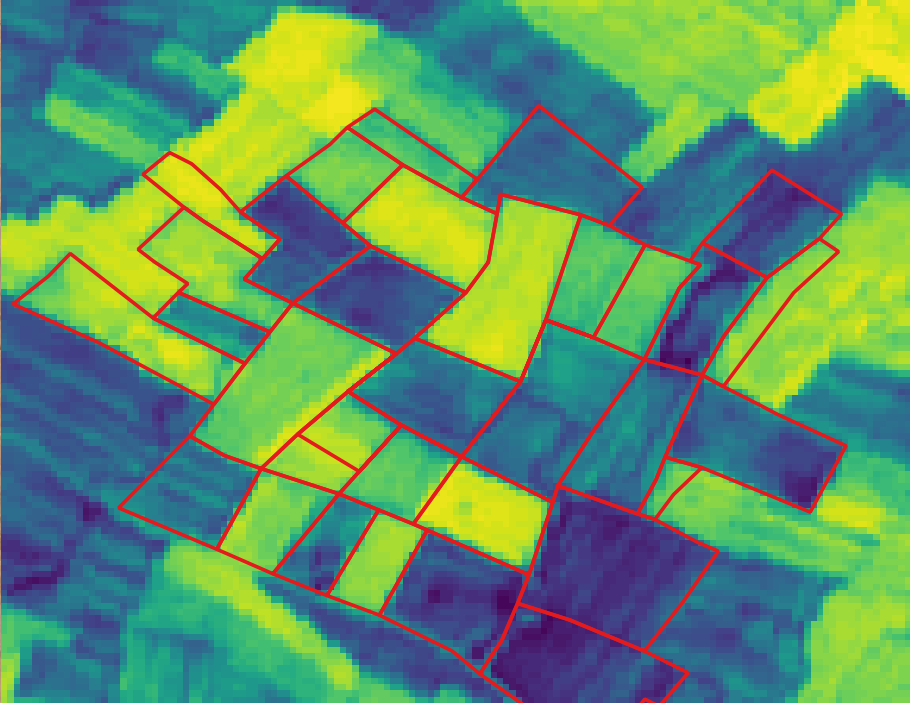
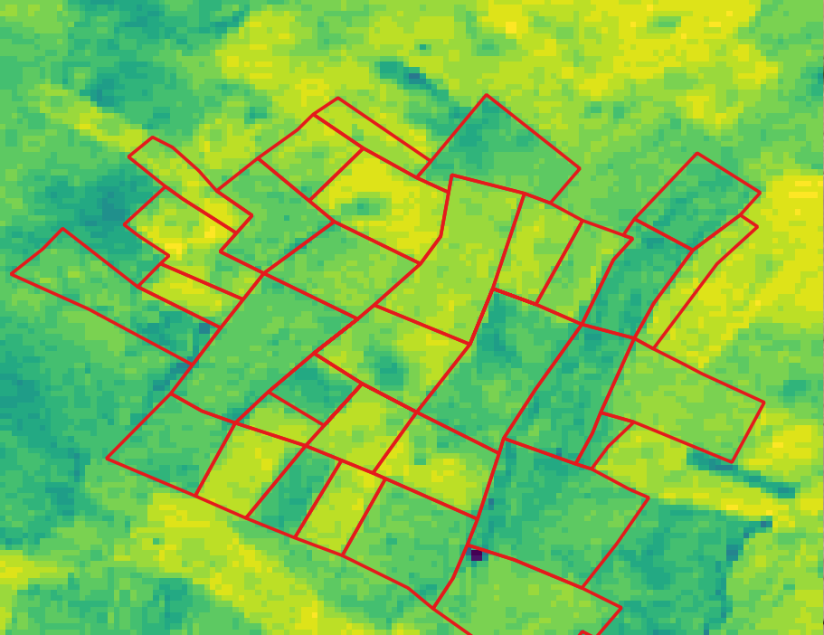
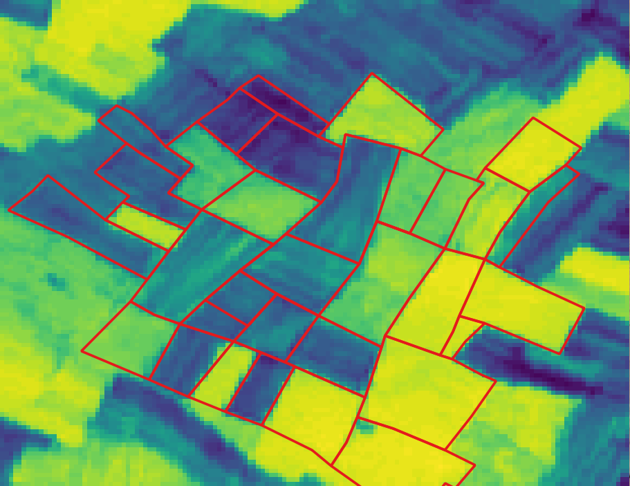
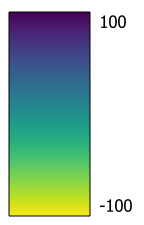
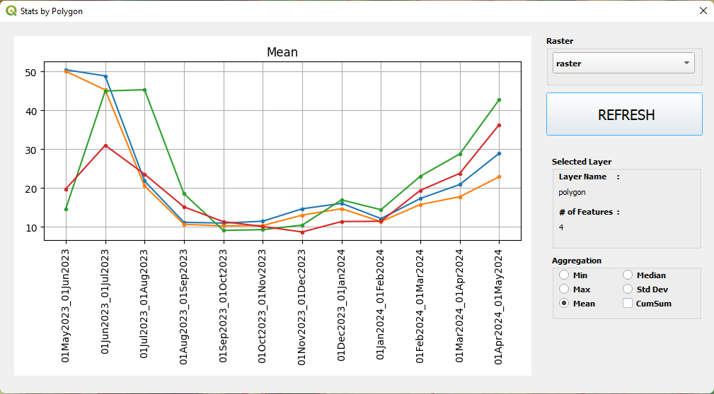

# QGIS Stats by Polygon Plugin

With this plugin, it is possible to create line plots using raster band values based on selected polygon.  
The figures below ( *Band 1, Band 2, ..., Band 12* ) illustrates the **_NDVI_** values of an area for given time period. 
The line plot graphs show the aggregated (*min, max, mean, median and std.dev.*) NDVI values of these bands based on selected polygons.

 

For creating these plots, a **_raster with multiple bands_** and a **_polygon_** layer with same ***CRS*** is needed. Bands of the raster is used for the plot. If **_multiple rasters_** exist, they can be combined into **_Virtual Raster_** and thus one raster with multiple bands can be created.

 

<table>
  <tr>
    <td> Band 1 (May2023)</td>
    <td> Band 3 (Jul2023)</td>
    <td> Band 5 (Sep2023)</td>
    <td> Band 7 (Nov2023)</td>
  </tr>
  <tr>    
    <td> Band 9 (Jan2024)</td>
    <td> Band 11 (Mar2024)</td>
    <td> Band 12 (Apr2024)</td>
    <td>Legend</td>
  </tr> 
</table>

 
 

<table>
    <tr>
      <td colspan="2"> Line Plot for Mean Value of Selected Polygons</td>
      <td colspan="2"> Line Plot for Cumulative Mean Value of Selected Polygons</td>
  </tr>
</table>

 

## Instructions  
* Select one or more polygon, 
* Click    icon, 
* If selected polygons are changed ***REFRESH*** button can be used to refresh the graph.

 
 

> [!NOTE]
> The raster and polygon data that was used to create the figures above can be found in [sample_data folder](https://github.com/caliskanmurat/qgis_stats_by_polygon_plugin/tree/main/sample_data)  
> The raster data here was prepared using [Google Earth Engine](https://earthengine.google.com/) platform, and polygons were created using QGIS Software.

