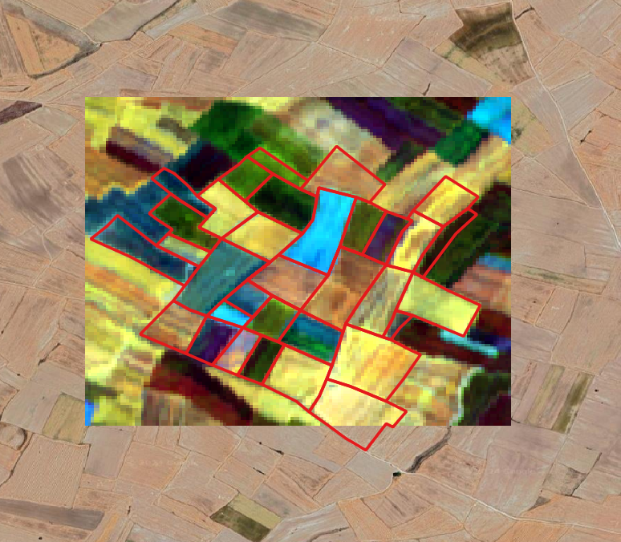
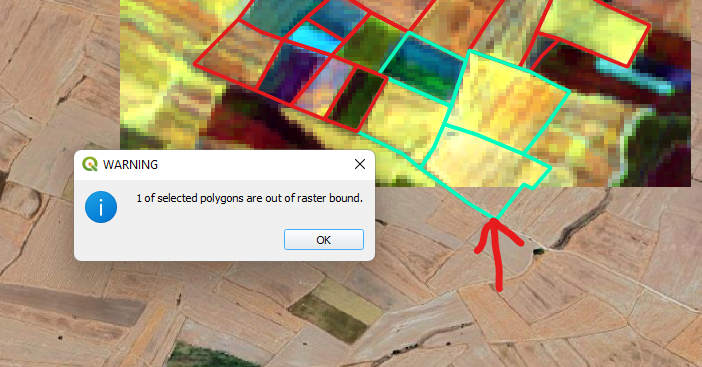

# QGIS Easy Raster Splitter Plugin

With this plugin, it is possible to split raster files into equally sized chunks.
 

<table style="border-collapse: collapse; border:1px solid red;" cellpadding="0" cellspacing="0" >
  <tr>
    <td> Band 1</td>
    <td> Band 3</td>
    <td> Band 5</td>
    <td rowspan="2"></td>
  </tr>
  <tr>
    <td> Band 7</td>
    <td> Band 9</td>
    <td> Band 12</td>
  </tr> 
  <tr>
    <td colspan="2"> Line Plot for Mean Value of Selected Polygons</td>
    <td colspan="2"> Line Plot for Cumulative Mean Value of Selected Polygons</td>
  </tr>
</table>

  

 

<table style="border-collapse: collapse; border:1px solid red;" cellpadding="0" cellspacing="0" >
  <tr>
    <td rowspan="2"></td>
    <td></td>    
    <td></td>
  </tr>
  <tr>
    <td></td>
    <td></td>
  </tr>  
  
</table>

<table style="border-collapse: collapse; border:1px solid red;" cellpadding="0" cellspacing="0" >
  <tr>
    <td></td>
  </tr>  
</table>
