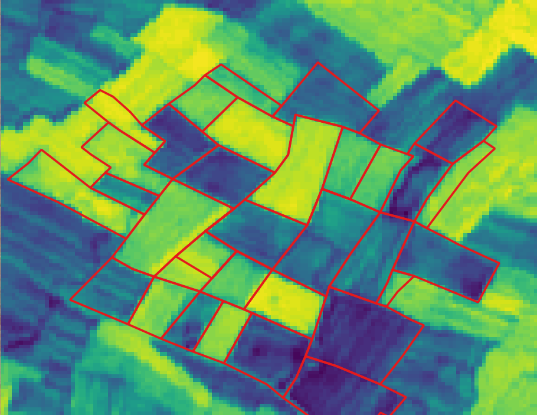
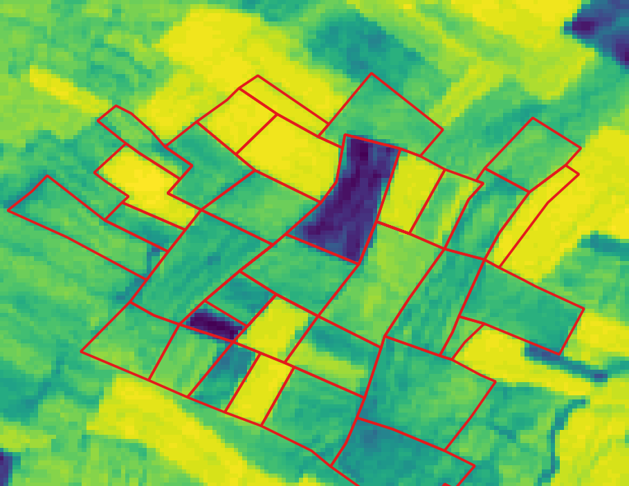
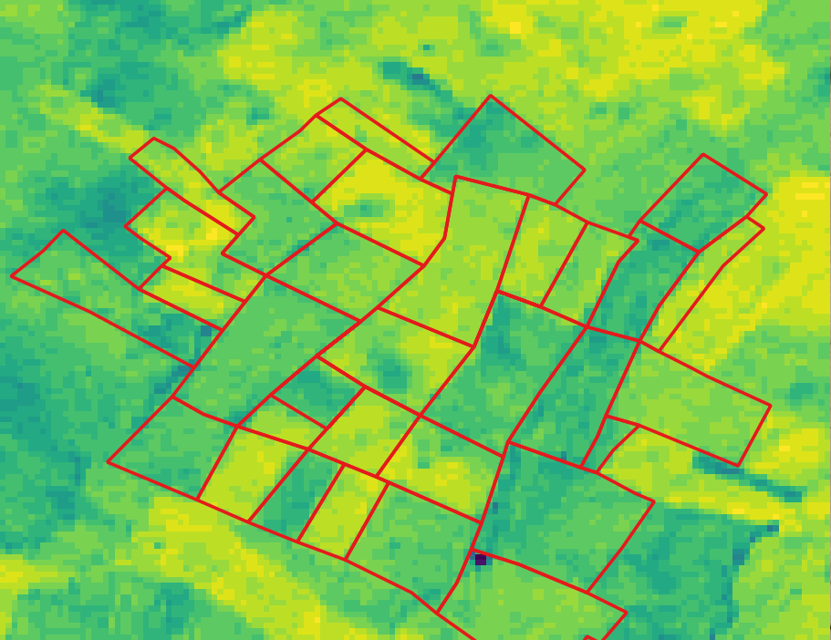
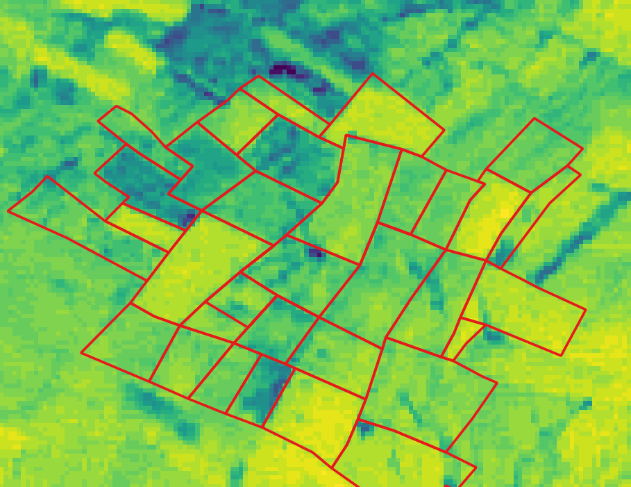
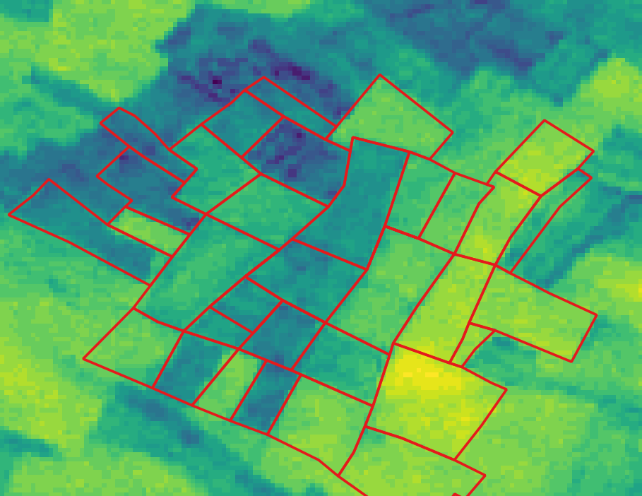
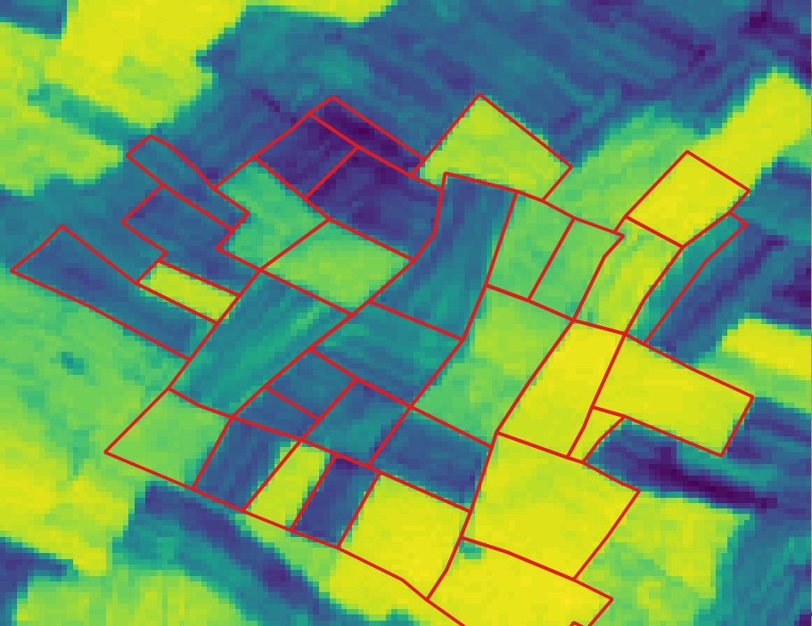
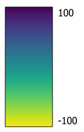
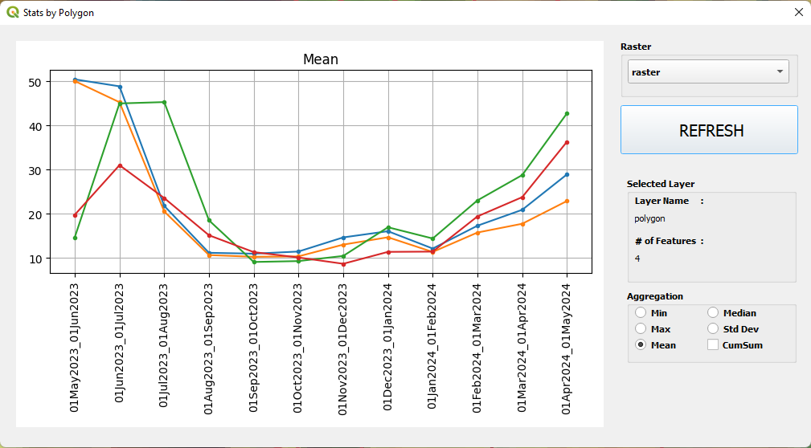
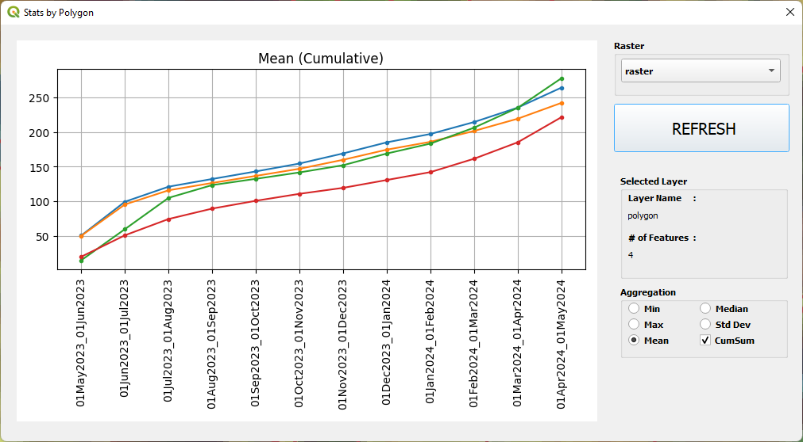

# QGIS Stats by Polygon Plugin

With this plugin, it is possible to create line plots using raster band values based on selected polygon. 
**As an instance**, the pictures below ( *Band 1, Band 2, ..., Band 12* ) illustrates the **_NDVI_** values of an area for given time period. 
The graphs shows 
 
 

<table>
  <tr>
    <td> Band 1 (May2023)</td>
    <td> Band 3 (Jul2023)</td>
    <td> Band 5 (Sep2023)</td>
    <td> Band 7 (Nov2023)</td>
  </tr>
  <tr>    
    <td> Band 9 (Jan2024)</td>
    <td> Band 11 (Mar2024)</td>
    <td> Band 12 (Apr2024)</td>
    <td></td>
  </tr> 
</table>
 
 
<table>
    <tr>
    <td colspan="2"> Line Plot for Mean Value of Selected Polygons</td>
    <td colspan="2"> Line Plot for Cumulative Mean Value of Selected Polygons</td>
  </tr>
</table>

